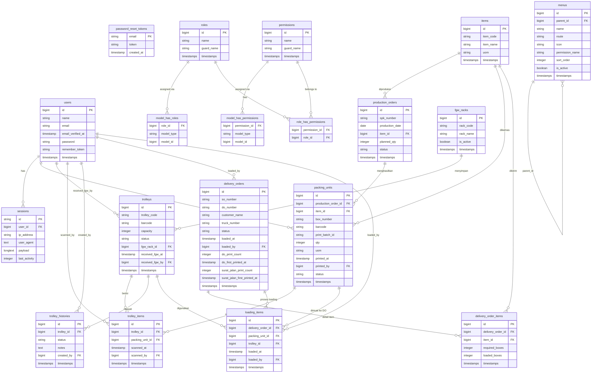

# ERD - Camiloplas Logistic



---

## Ringkasan Tabel

| Grup | Tabel | Keterangan |
|------|-------|------------|
| **Auth** | `users`, `sessions`, `password_reset_tokens` | Manajemen user & session |
| **Permission** | `roles`, `permissions`, `model_has_roles`, `model_has_permissions`, `role_has_permissions` | Spatie Laravel Permission |
| **Menu** | `menus` | Navigasi dinamis (self-referential tree) |
| **Master** | `items`, `fgw_racks` | Data master barang & rak gudang |
| **Produksi** | `production_orders`, `packing_units` | SPK & hasil packing |
| **Trolley** | `trolleys`, `trolley_items`, `trolley_histories` | Manajemen trolley & isinya |
| **Pengiriman** | `delivery_orders`, `delivery_order_items`, `loading_items` | DO, item DO, & proses loading |

---

## Alur Utama Logistik

```
items
  └─► production_orders (SPK)
          └─► packing_units (hasil packing per box/barcode)
                    └─► trolley_items ────► trolleys ────► fgw_racks
                    └─► loading_items ────► delivery_orders
                                                └─► delivery_order_items
```
